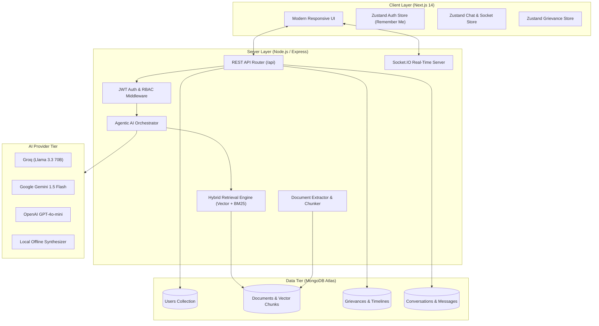
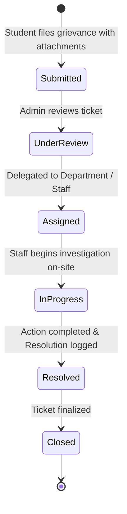

# 🎓 CampusMind – RAG-Based College AI Assistant

[](https://nodejs.org/)
[](https://nextjs.org/)
[](https://expressjs.com/)
[](https://www.mongodb.com/)
[](https://socket.io/)
[](https://tailwindcss.com/)

**CampusMind** is an enterprise-grade, full-stack **AI College Assistant** built on a **Retrieval-Augmented Generation (RAG)** and **Agentic AI architecture**. It empowers students to ask natural language questions regarding admissions, tuition fees, hostel regulations, examination policies, scholarships, placements, and campus facilities, delivering verified answers that are **grounded strictly in official college documents** with traceable source citations, confidence scores, and zero hallucinations.

In addition to intelligent document querying, CampusMind features an end-to-end **Student Grievance & Issue Resolution Portal** with real-time Socket.IO synchronization, automated timeline tracking, department delegation, and comprehensive administrative analytics.

---

## 📌 Table of Contents

- [Problem Statement](#-problem-statement)
- [Solution](#-solution)
- [Key Features](#-key-features)
- [How CampusMind Works](#-how-campusmind-works)
- [RAG Architecture](#-rag-architecture)
- [Agentic RAG Pipeline](#-agentic-rag-pipeline)
- [System Architecture](#-system-architecture)
- [User Roles & Access Matrix](#-user-roles--access-matrix)
- [Student Grievance & Resolution Workflow](#-student-grievance--resolution-workflow)
- [Technology Stack](#-technology-stack)
- [Project Structure](#-project-structure)
- [Authentication & Security](#-authentication--security)
- [REST API Reference](#-rest-api-reference)
- [Installation & Local Setup](#-installation--local-setup)
- [Environment Variables](#-environment-variables)
- [Testing & Verification Suite](#-testing--verification-suite)
- [Deployment Guide](#-deployment-guide)
- [Learning Outcomes](#-learning-outcomes)
- [License](#-license)

---

## 🎯 Problem Statement

College students and prospective applicants frequently navigate complex, scattered institutional information across multiple PDFs, bulletin boards, and handbooks, including:
- **Academic Procedures & Examination Rules**: Grading criteria, attendance minimums, backlog policies, and re-evaluation guidelines.
- **Admissions & Fee Policies**: Installment schedules, refund terms, scholarship eligibility, and quota details.
- **Campus Facilities & Hostel Rules**: Curfew timings, mess leave rebates, room allotment, and discipline guidelines.
- **Administrative Red Tape**: Lodging maintenance requests or academic complaints traditionally requires paper forms or in-person visits with no transparency on resolution progress.

Traditional solutions either rely on generic LLMs (which hallucinate college-specific facts) or manual administrative desks (which are unavailable outside office hours).

---

## 💡 Solution

CampusMind bridges this gap by combining **Agentic RAG document intelligence** with **real-time grievance lifecycle management**:

1. **Grounded Document Intelligence**: Queries are answered exclusively using retrieved chunks from verified institutional policies, complete with document names, similarity ratings, and page references.
2. **Autonomous Agentic Retrieval**: An LLM agent reasons whether college documentation is required, formulates targeted search arguments, invokes retrieval tools, and synthesizes direct answers.
3. **Multilingual Access**: Full conversational support across **English**, **Hindi (हिंदी)**, and **Marathi (मराठी)**.
4. **Transparent Grievance Lifecycle**: Students can submit complaints with multi-file evidence and track real-time progress across a 6-stage resolution pipeline with official administrative remarks.
5. **Administrative Governance**: Staff can upload new policy documents, monitor knowledge base gaps, review unanswered queries, and delegate grievances to departments.

---

## ⭐ Key Features

### 1. 🤖 Conversational AI College Assistant
- Natural language chat interface with conversational memory across multi-turn dialogues.
- Category filtering (`Academic`, `Hostel`, `Fee & Accounts`, `Placements`, `Scholarships`, `Library`, `General`).
- Conversation export to Markdown (`.md`) and JSON (`.json`) for student reference.

### 2. 🔍 Retrieval-Augmented Generation (RAG)
- Extracts text from uploaded institutional files (`.pdf`, `.docx`, `.txt`).
- Breaks text into semantically cohesive chunks (~800 characters with 150-character overlap).
- Generates 768-dimensional dense vector embeddings stored in MongoDB.
- Executes similarity matching before prompting the LLM, grounding all answers in verified facts.

### 3. ⚡ Hybrid Search (Vector + BM25 Keyword)
- Combines dense semantic vector retrieval (Cosine Similarity / MongoDB Atlas `$vectorSearch`) with sparse keyword matching (BM25 scoring).
- Ensures high retrieval precision for both conceptual inquiries (*"Can I get a fee waiver?"*) and exact keywords (*"Form 10B refund deadline"*).

### 4. 🧠 Agentic RAG Architecture
- Features an autonomous orchestration layer powered by `agentService.js`.
- Implements function calling with the `searchCollegeDocs` tool.
- Supports iterative reasoning (up to 3 agent iterations) to evaluate whether retrieved context sufficiently answers the prompt before formulating a response.

### 5. 🔄 Multi-Provider AI Fallback Chain
- Resilient LLM generation pipeline:
  1. **Groq** (`llama-3.3-70b-versatile`)
  2. **Google Gemini** (`gemini-1.5-flash` / `gemini-1.5-pro`)
  3. **OpenAI** (`gpt-4o-mini` / `gpt-3.5-turbo`)
  4. **OpenRouter** (`deepseek-r1` / `meta-llama`)
  5. **Deterministic Offline RAG Synthesizer** (Guarantees system uptime even without external API credits).

### 6. 🌊 Real-Time Token Streaming (Socket.IO)
- Streams tokens progressively to the client as they are generated (`chat:token`, `chat:done`).
- Eliminates waiting for complete answer generation and provides an interactive user experience.

### 7. 📚 Traceable Source Citations & Page References
- Displays interactive source cards below every AI answer detailing:
  - Document Title & Category
  - Match Similarity Score (%)
  - Exact Document Page Number
  - Modal excerpt viewer for instant source verification.

### 8. 🛡️ Honest Unknown Detection & Confidence Scoring
- Calculates a structured confidence score based on top-k retrieval similarity.
- Queries falling below the similarity threshold (`0.72`) trigger an honest fallback directing the student to the relevant campus office rather than guessing.

### 9. 🌐 Multilingual Support (English, Hindi, Marathi)
- Students can seamlessly switch languages on the chat interface.
- Translates answers while preserving institutional terminology, dates, and numbers.

### 10. 💡 Suggested Questions
- Category-aware promotional query chips (*"What is the hostel curfew?"*, *"What are the scholarship criteria?"*) for quick 1-click exploration.

### 11. 👍 / 👎 Answer Feedback System
- Instant response rating mechanism logging student satisfaction to the administrative analytics dashboard.

### 12. 🔐 Authentication & Persistent "Remember Me"
- Secure JWT authentication with bcrypt password hashing (cost factor 12).
- Dual storage architecture:
  - **Remember Me Checked**: Session stored in `localStorage` (persists across browser restarts).
  - **Remember Me Unchecked**: Session stored in `sessionStorage` (cleared automatically on tab close).

### 13. 📊 Student & Admin Dashboards
- **Student Dashboard**: Live grievance metrics (Submitted, In Progress, Resolved), recent activity tracker, quick action shortcuts.
- **Admin Portal**: System-wide statistics, knowledge base document manager, grievance delegation, and gap analysis logs.

### 14. 📢 Comprehensive Student Grievance Portal
- Multi-file evidence uploader (Images, PDF, DOCX up to 10MB).
- 6-Stage Visual Progress Tracker: `Submitted` ➔ `Under Review` ➔ `Assigned` ➔ `In Progress` ➔ `Resolved` ➔ `Closed`.
- Real-time Socket.IO status and remark broadcasting to student devices.
- Administrative department delegation (Hostel Warden, Estate Cell, Dean Office, IT Services).

### 15. 🔒 Student Isolation & Privacy Protection
- Strict authorization barriers preventing students from viewing or modifying other students' grievances.

---

## 🔄 How CampusMind Works

```
Student Inquires (Chat UI)
        │
        ▼
Authentication Guard (JWT)
        │
        ▼
Agentic Orchestrator (agentService)
        │
        ├─▶ Evaluates Query Intent
        │
        ▼
Search Tool Invoked (searchCollegeDocs)
        │
        ├─▶ Generates 768-dim Query Embedding
        ├─▶ Hybrid Retrieval (Vector Cosine Search + BM25)
        ├─▶ Filters Chunks by Category & Similarity Threshold (>= 0.72)
        │
        ▼
Contextual Grounding
        │
        ├─▶ Structured Prompt + Multi-Turn Chat History + Document Chunks
        │
        ▼
LLM Generation & Fallback Chain (Groq ➔ Gemini ➔ OpenAI ➔ Offline Synthesizer)
        │
        ▼
Socket.IO Progressive Streaming (`chat:token`)
        │
        ▼
Structured Output Delivered: Grounded Answer + Source Cards + Confidence Rating
```

---

## 🧠 RAG Architecture

Retrieval-Augmented Generation in CampusMind operates through a two-phase architecture:

### 1. Ingestion Phase (Admin Side)
1. **Document Upload**: Admin uploads institutional brochures/handbooks (`PDF`, `DOCX`, `TXT`).
2. **Text Extraction & Normalization**: Strips formatting and normalizes text streams.
3. **Recursive Character Chunking**: Splits content into ~800-character segments with a 150-character sliding overlap to preserve sentence context.
4. **Vector Embedding**: Each chunk is transformed into a 768-dimensional dense numerical vector using Google Gemini / OpenAI embeddings.
5. **Database Storage**: Chunks are stored in the MongoDB `documentchunks` collection with category metadata.

### 2. Retrieval & Generation Phase (Student Side)
1. **Query Embedding**: The student's question is embedded into the same 768-dimensional vector space.
2. **Similarity Matching**: Computes cosine distance against stored chunks (or runs MongoDB Atlas `$vectorSearch`).
3. **Threshold Gate**: Chunks with similarity score $\ge 0.72$ are retrieved; otherwise, the system triggers the unanswerable guidance fallback.
4. **Augmented Prompting**: Injects verified chunks into a strict system prompt instructing the model to answer *only* using provided context.
5. **Citation Attribution**: Attaches source title, category, similarity rating, and page numbers to the response.

---

## 🤖 Agentic RAG Pipeline

Unlike basic RAG pipelines that blindly retrieve text for every prompt, **CampusMind Agentic RAG** employs an autonomous decision-making cycle:

| Step | Action | Description |
| :--- | :--- | :--- |
| **1. Intent Analysis** | Reasoning | The agent inspects the user message and determines if college knowledge is required or if it is a general greeting. |
| **2. Tool Execution** | `searchCollegeDocs` | The agent calls the retrieval tool with optimized query parameters and category filters. |
| **3. Evaluation** | Reflection | The agent assesses if retrieved documents are adequate. If ambiguous, it refines its search query (up to 3 iterations). |
| **4. Synthesis** | Direct Answer | The agent synthesizes a concise, direct natural language answer using only the relevant excerpts. |

---

## 🏗️ System Architecture



---

## 👥 User Roles & Access Matrix

| Feature / Resource | Student | Administrator |
| :--- | :---: | :---: |
| **AI College Chatbot & History** | ✅ | ✅ |
| **Multilingual Switching (EN / HI / MR)** | ✅ | ✅ |
| **Submit New Grievance & Upload Evidence** | ✅ | ❌ |
| **View Own Grievances & Live Timeline** | ✅ | ✅ |
| **Admin Grievance Management & Status Updates** | ❌ | ✅ |
| **Department & Staff Delegation** | ❌ | ✅ |
| **Document Knowledge Base Upload & Reprocessing** | ❌ | ✅ |
| **Analytics, Gap Analysis & Unanswered Query Logs**| ❌ | ✅ |

---

## 📢 Student Grievance & Resolution Workflow



### Real-Time Lifecycle Sync:
1. **Submission**: Student submits a ticket with category, priority, description, location, and attachments.
2. **Live Broadcast**: Server emits `complaint:new` alerting all active admin portals.
3. **Administrative Action**: Admin changes status (e.g. `In Progress`) and enters progress notes.
4. **WebSocket Push**: Server broadcasts `complaint:updated` and `complaint:statusChanged`.
5. **Instant UI Refresh**: Student's active session receives the update via WebSocket and displays the new status badge, progress note, and timestamp without requiring manual page reload.

---

## 💻 Technology Stack

### **Frontend Client**
- **Framework**: Next.js 14 (Pages Router)
- **UI & Styling**: Vanilla Tailwind CSS, Glassmorphic Design System, CSS Keyframe Animations
- **State Management**: Zustand
- **Icons**: Lucide React
- **Markdown Rendering**: React-Markdown, Remark-GFM
- **Real-Time Client**: Socket.IO Client
- **HTTP Client**: Axios (with session-aware token interceptors)

### **Backend Server**
- **Runtime**: Node.js (v18+)
- **Framework**: Express.js
- **Real-Time Engine**: Socket.IO
- **Database & ODM**: MongoDB Atlas, Mongoose
- **Security & Auth**: JWT (jsonwebtoken), Bcrypt.js, Helmet, CORS, Express-Rate-Limit
- **File Ingestion**: Multer, PDF-Parse, Mammoth (DOCX)
- **AI SDKs**: `@google/generative-ai`, `groq-sdk`, `openai`

---

## 📂 Project Structure

```
CampusMind/
├── client/                               # Next.js 14 Frontend Application
│   ├── src/
│   │   ├── components/                   # Reusable UI Components
│   │   │   ├── ChatWindow/               # Main chat container with category filters
│   │   │   ├── DocumentTable/            # Admin document list with live status
│   │   │   ├── DocumentUploadForm/       # Drag-and-drop document uploader
│   │   │   ├── MessageBubble/            # Markdown text, streaming, citations, feedback
│   │   │   ├── Navbar/                   # Responsive navigation bar with role badge
│   │   │   ├── ProtectedRoute/           # Route guard for student/admin access
│   │   │   └── SourceCitation/           # Verified document citation cards & modal
│   │   ├── pages/                        # Next.js Page Routes
│   │   │   ├── admin/
│   │   │   │   ├── analytics.js          # Gap analysis & response ratings
│   │   │   │   ├── complaints.js         # Admin grievance management & delegation
│   │   │   │   ├── documents.js          # Knowledge base upload & management
│   │   │   │   └── index.js              # Admin overview dashboard
│   │   │   ├── chat/
│   │   │   │   ├── [conversationId].js   # Saved conversation viewer
│   │   │   │   └── index.js              # Live conversational AI assistant
│   │   │   ├── complaints/
│   │   │   │   ├── [id].js               # 6-stage grievance progress & discussion
│   │   │   │   ├── index.js              # Student grievance history list
│   │   │   │   └── new.js                # Grievance submission form
│   │   │   ├── _app.js                   # Application root & auth bootstrap
│   │   │   ├── dashboard.js              # Student metric dashboard
│   │   │   ├── faqs.js                   # Categorized institutional FAQs
│   │   │   ├── index.js                  # Hero landing page & feature highlights
│   │   │   ├── login.js                  # Login with Remember Me & demo credentials
│   │   │   ├── register.js               # Student registration
│   │   │   └── settings.js               # Profile editor & conversation export
│   │   ├── services/                     # api.js (Axios), socket.js (Socket.IO)
│   │   ├── store/                        # authStore.js, chatStore.js, complaintStore.js
│   │   └── styles/                       # globals.css (Tailwind & custom design tokens)
│   ├── package.json
│   └── tailwind.config.js
│
├── server/                               # Node.js / Express Backend & RAG Engine
│   ├── sample_docs/                      # Sample college brochures, policies & rules
│   ├── src/
│   │   ├── config/                       # env.js, db.js, socket.js
│   │   ├── controllers/                  # auth, chat, document, complaint, analytics
│   │   ├── middlewares/                  # auth.js, errorHandler.js, rateLimiter.js
│   │   ├── models/                       # User, Document, DocumentChunk, Complaint, etc.
│   │   ├── routes/                       # auth, chat, document, complaint, analytics
│   │   ├── scripts/                      # seedAdmin.js, seedSampleDocs.js, testRAG.js
│   │   ├── services/                     # agentService, retrievalService, chatService, etc.
│   │   ├── utils/                        # chunker.js, documentExtractor.js, vectorMath.js
│   │   └── server.js                     # Express application entry point
│   ├── package.json
│   └── testRememberMe.js
│
├── deploy.md                             # Step-by-step production deployment manual
├── deployment.md                         # 20-phase enterprise deployment checklist
├── specs.md                              # Single source of truth specifications
└── README.md                             # Project overview & documentation
```

---

## 🔐 Authentication & Security

- **Password Hashing**: Passwords salted and hashed with **bcrypt** (cost factor 12).
- **JWT Authorization**: Cryptographically signed JSON Web Tokens passed via `Authorization: Bearer <token>` headers.
- **Persistent Sessions**: Non-sensitive session data stored conditionally in `localStorage` (Remember Me) or `sessionStorage` (Single Session).
- **Role-Based Guards**: Protected backend routes with `authorize('admin')` middleware and frontend client guards (`ProtectedRoute.js`).
- **Input Sanitization**: File type validation for uploads (`PDF`, `DOCX`, `TXT`, `PNG`, `JPG`), size caps (10MB), and MongoDB query sanitization.
- **Zero Client Secrets**: No API keys, JWT secrets, or database connection strings are exposed to the browser.

---

## 📡 REST API Reference

### 🔐 Authentication (`/api/auth`)
| Method | Endpoint | Description | Auth |
| :--- | :--- | :--- | :---: |
| `POST` | `/api/auth/register` | Register a new student account | Public |
| `POST` | `/api/auth/login` | Log in and receive JWT token | Public |
| `GET` | `/api/auth/me` | Fetch authenticated profile & verify session | Required |
| `PUT` | `/api/auth/password` | Update account password | Required |
| `POST` | `/api/auth/logout` | Terminate session | Public |

### 💬 Chat & RAG Intelligence (`/api/chat`)
| Method | Endpoint | Description | Auth |
| :--- | :--- | :--- | :---: |
| `POST` | `/api/chat/message` | Submit query, execute Agentic RAG, stream answer | Required |
| `GET` | `/api/chat/conversations` | List user conversation history | Required |
| `GET` | `/api/chat/conversations/:id` | Fetch full chat transcript with citations | Required |
| `DELETE` | `/api/chat/conversations/:id` | Delete conversation and associated messages | Required |
| `POST` | `/api/chat/messages/:id/feedback` | Submit 👍 / 👎 rating on AI answer | Required |

### 📢 Grievance Management (`/api/complaints`)
| Method | Endpoint | Description | Auth |
| :--- | :--- | :--- | :---: |
| `POST` | `/api/complaints` | Submit new grievance with attachments | Student |
| `GET` | `/api/complaints` | Fetch logged-in student's complaints & timeline | Student |
| `GET` | `/api/complaints/:id` | Fetch single grievance details & discussion thread | Private |
| `POST` | `/api/complaints/:id/comments` | Add comment to grievance discussion | Private |
| `GET` | `/api/complaints/admin/list` | Admin: Fetch all grievances with filters & pagination | Admin |
| `GET` | `/api/complaints/admin/stats` | Admin: Grievance metrics, categories & resolution rates | Admin |
| `PATCH/PUT` | `/api/complaints/admin/:id/status` | Admin: Update status, progress notes & resolution | Admin |
| `PATCH/PUT` | `/api/complaints/admin/:id/assign` | Admin: Delegate to department & staff member | Admin |
| `PATCH/PUT` | `/api/complaints/admin/:id/priority` | Admin: Update priority level | Admin |
| `DELETE` | `/api/complaints/admin/:id` | Admin: Delete complaint record | Admin |

### 📄 Knowledge Base Documents (`/api/admin/documents`)
| Method | Endpoint | Description | Auth |
| :--- | :--- | :--- | :---: |
| `GET` | `/api/admin/documents` | List uploaded documents with ingestion state | Admin |
| `POST` | `/api/admin/documents` | Upload PDF/DOCX/TXT file for ingestion | Admin |
| `POST` | `/api/admin/documents/:id/reprocess` | Re-extract, re-chunk, and re-embed document | Admin |
| `DELETE` | `/api/admin/documents/:id` | Delete document and remove vector chunks | Admin |

### 📊 Analytics & Gap Analysis (`/api/admin/analytics`)
| Method | Endpoint | Description | Auth |
| :--- | :--- | :--- | :---: |
| `GET` | `/api/admin/analytics/overview` | Summary metrics, citation counts, category distribution | Admin |
| `GET` | `/api/admin/analytics/unanswered` | Knowledge base gap logs (queries with score < 0.72) | Admin |

---

## 🚀 Installation & Local Setup

### Prerequisites
- **Node.js**: `v18.0.0` or higher
- **npm**: `v9.x` or higher
- **MongoDB**: Local instance, MongoDB Atlas, or zero-config in-memory fallback.

---

### Step 1: Clone Repository & Install Dependencies
```bash
git clone https://github.com/sonuprasad100e-eng/CampusMind-RAG-Chatbot.git
cd CampusMind-RAG-Chatbot

# Install all dependencies across root, server, and client
npm run install:all
```

---

### Step 2: Configure Environment Variables

1. **Backend Environment** (`server/.env`):
```ini
PORT=5000
NODE_ENV=development
CLIENT_URL=http://localhost:3000

# JWT Configuration
JWT_SECRET=campusmind_secure_jwt_secret_key_2026
JWT_EXPIRES_IN=7d

# Database Connection
MONGODB_URI=mongodb://127.0.0.1:27017/campusmind

# RAG Thresholds
RAG_SIMILARITY_THRESHOLD=0.72
RAG_TOP_K=5

# AI Provider API Keys (Optional - Local Synthesizer runs if empty)
GEMINI_API_KEY=
GROQ_API_KEY=
OPENAI_API_KEY=
OPENROUTER_API_KEY=
```

2. **Frontend Environment** (`client/.env.local`):
```ini
NEXT_PUBLIC_API_URL=http://localhost:5000/api
NEXT_PUBLIC_SOCKET_URL=http://localhost:5000
```

---

### Step 3: Seed Database & Knowledge Base
```bash
# Seed default Student & Admin accounts
npm run seed:admin

# Ingest sample college policy documents
npm run seed:docs
```

---

### Step 4: Run the Application
```bash
npm run dev
```

- 🌐 **Frontend Client**: [http://localhost:3000](http://localhost:3000)
- 🔌 **Backend API**: [http://localhost:5000/api](http://localhost:5000/api)
- 💓 **API Health Status**: [http://localhost:5000/api/health](http://localhost:5000/api/health)

---

## 🔑 Pre-Configured Demo Credentials

| Account Role | Email Address | Password | Privileges |
| :--- | :--- | :--- | :--- |
| **Student** | `student@campusmind.edu` | `Student@123456` | RAG Chat, Citations, Multilingual, Grievance Submission |
| **Administrator** | `admin@campusmind.edu` | `Admin@123456` | Document Ingestion, Grievance Management, Gap Analytics |

*(Quick 1-click credential buttons are available on the `/login` page).*

---

## 🧪 Testing & Verification Suite

CampusMind includes comprehensive verification suites to validate RAG precision, authentication persistence, and grievance workflows:

```bash
# 1. Test Semantic Vector Search & RAG Grounding
npm run test:rag

# 2. Test Remember Me & Session Persistence
node server/testRememberMe.js

# 3. Test Agentic Function Calling & Provider Fallbacks
node server/testAgent.js

# 4. Compile Frontend Production Build
cd client && npm run build
```

---

## 🌐 Deployment Guide

| Component | Recommended Host | Configuration Details |
| :--- | :--- | :--- |
| **Frontend** | **Vercel** | Root directory: `client`<br>Framework: Next.js<br>Environment: `NEXT_PUBLIC_API_URL`, `NEXT_PUBLIC_SOCKET_URL` |
| **Backend** | **Render / Railway** | Root directory: `server`<br>Build command: `npm install`<br>Start command: `node src/server.js` |
| **Database** | **MongoDB Atlas** | M0 Free Tier<br>Vector Index: `vector_index` on `documentchunks` (768 dimensions, cosine similarity) |

*(Refer to [`deploy.md`](file:///c:/Users/Admin/OneDrive/Desktop/RAG-Based_clg_chatbot/deploy.md) for full step-by-step production instructions).*

---

## 📚 Learning Outcomes

Building CampusMind provided deep, practical experience across modern full-stack AI development:
- **Retrieval-Augmented Generation**: Implementing document chunking strategies, dense embeddings, vector indexing, and grounded prompt engineering.
- **Agentic AI Architecture**: Building autonomous tool-calling loops with fallback logic and structured decision reasoning.
- **Real-Time WebSockets**: Designing two-way streaming pipelines with Socket.IO for real-time text generation and instant multi-user grievance synchronization.
- **Full-Stack Security & RBAC**: Implementing stateless JWT authorization, password hashing, and role-based route protection.
- **State Management & UI/UX**: Crafting responsive glassmorphic interfaces with Tailwind CSS and Zustand stores.

---

## 📄 License

This project is licensed under the **ISC License**. Created with ❤️ for students, faculty, and academic institutions.
